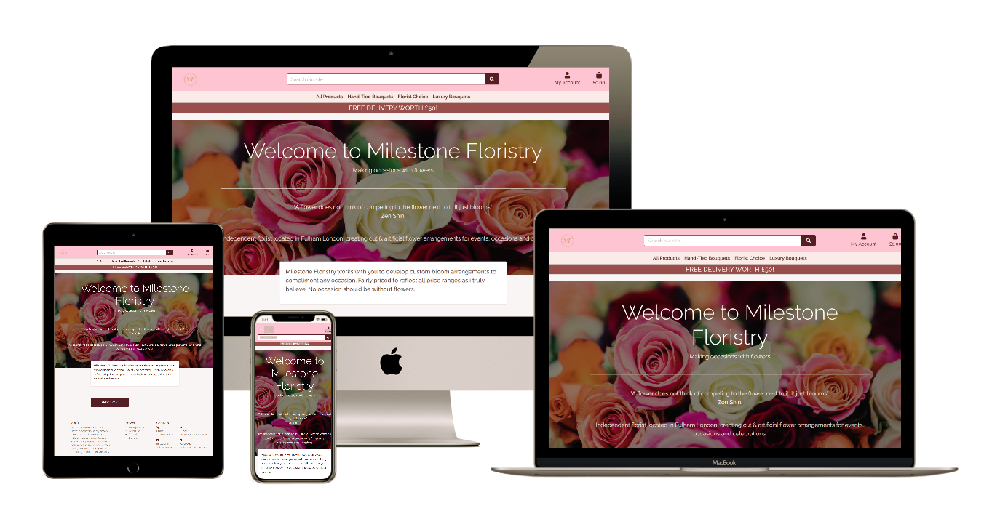

# Milestone Floristry

For this project i'll be building a full-stack site based around business logic used to control a centrally-owned dataset. I will set up an authentication mechanism and provide paid access to the site's data and/or other activities based on the dataset, such as the purchase of a product/service.<br><br>



<br>

For this project, I will be creating an elegant website for a Floristry company that has been providing floral arrangements for the past two years. The website will increase company profile and showcase the florists range of products and services as well as providing inspiration and advice.

## UX

<hr>

The Website is for anyone that wants floral arrangements/bouquets for the home special occasion or as a gift. The website will also provide advice information and aftercare for arrangements/bouquets.

### User Stories

- As a user, I want to see all types of arrangements.
- As a user, I want to know of any special offers.
- As a user, I want to know the price of arrangements.
- As a user, I want advice on flower arrangements.
- As a user, I want to be informed of money off deals.
- As a user, I want tips and tricks on flower arrangement care.
- As a user, I want to access the platform from a desktop, tablet or a smartphone.
- As a user, I want to view several kinds of products.
- As a user, I want to view a specific kind of product.
- As a user, I want to buy arrangements.
- As a user, I want to update the amount of products in my shopping bag.
- As a user, I want to remove products in my shopping bag.
- As a user, I want to make online payments.
- As a user, I want to see details of a specific product.
- As a user, I want to receive order details to my email.
- As a user, I want to have or not have a user account.

## Wireframe

<hr>

#### I have used Figma to create layout mockups.

- Please find mobile tablet and desktop mockup for home page layout <a href="assets/wireframes/home.pdf">here</a>
- Please find mobile tablet and desktop mockup for products page layout <a href="assets/wireframes/products.pdf">here</a>
- Please find mobile tablet and desktop mockup for product info page layout <a href="assets/wireframes/product_info.pdf">here</a>
- Please find mobile tablet and desktop mockup for shopping bag page layout <a href="assets/wireframes/shopping_bag.pdf">here</a>
- Please find mobile tablet and desktop mockup for checkout page layout <a href="assets/wireframes/checkout.pdf">here</a>
- Please find mobile tablet and desktop mockup for order info page layout <a href="assets/wireframes/order_info.pdf">here</a>
- Please find mobile tablet and desktop mockup for sign up page layout <a href="assets/wireframes/sign_up.pdf">here</a>
- Please find mobile tablet and desktop mockup for my profile page layout <a href="assets/wireframes/my_profile.pdf">here</a>

## Features

<hr>

### Existing Features

#### Navbar

- Fixed top navbar
- A menu button will display on mobile and tablet views
- Logo, redirects user to home page
- Search input, redirects to product
- My account, redirects user to either login register logout and my profile;
  - Logged In
    - User will be redirected to Profile details, Order History and Logout
    - Profile details redirects user to Profile Details page
    - Logout, redirects the user to Logout page
  - Logged Out
    - Register, redirects user to register form
    - Login, redirects user to login form
- shopping bag with checkout total, redirects user to the bag page

#### Main nav

- Fixed main nav below navbar
- Product categories, all products hand tied bouquets florist choice and luxury bouquets

#### Home page

- Button redirects user to products page

#### Products page

- Displayed at top of main page is product count and category of product
- Cards with product image, redirects user to selected product page
- Name price and category
- Return to top button

#### Product detail page

- Add to shopping bag button, adds product to user bag
- Up and down arrow buttons, increase and decrease the amount of items to be add to bag
- Card image, redirects and displays an enlarged image

#### Profile page

- Order form, displays a form with the user's order number and order history
- Order number link, redirects the user to a detailed order
- Customer information, displays a form with the user's current information
- Update button, writes user updates to form
- Home button, redirects non-registered user to products page
- Order button, redirects registered user to order history page

#### Bag page

- Delete button, deletes specific/selected product from bag
- Update button, updates the amount of items in the bag
- Up and down arrow buttons, increase or decrease the amount of items in the bag
- Back to products button, redirects the user to products page
- Checkout button, redirects the user to checkout page

#### Checkout page

- Billing form must be filled out by user to place an order
- Payment fieldset. A fieldset that needs to be filled with card number, CVC and expiration date
- Submit button that submits the order and redirects the user to a checkout success page that displays placed order
- Save check symbol, saves user's order details for future purchases
- Login link, user can login before purchasing
- Register link, user can register before purchasing
- Adjust bag button, Redirects user to bag page.

#### Footer

- An about section with a brief write up
- A services section for other services
- Contact section, with mobile email and social links

### Future implementations

- About page
- Contact page so the customer can send emails directly from the store to the admin.

# Technologies Used

The technologies used were:

## Languages:

- <a href="https://developer.mozilla.org/en-US/docs/Web/Guide/HTML/HTML5">HTML5</a>
  - This project uses HTML5 for basic layout and function
- <a href="https://developer.mozilla.org/en-US/docs/Archive/CSS3">CSS3</a>
  - This project uses CSS3 for class and element styling
- <a href="https://developer.mozilla.org/en-US/docs/Web/JavaScript">Javascript</a>
  - This project uses Javascript for the dynamic responsive website
- <a href="https://www.json.org/json-en.html">JSON</a>
- <a href="https://www.python.org/">Python</a>
  - This project uses Python to write the logic for the site

## Libraries:

- <a href="https://getbootstrap.com/">Bootstrap</a>
  - This project uses Bootstrap to simplify the structure of the website and make the website responsive easily
- <a href="https://www.djangoproject.com/">Django</a>
  - This project uses Django for the web-framework
- <a href="https://fontawesome.com/">Font Awesome</a>
  - This project use Font Awesome for icons
- <a href="https://fonts.google.com/">Google Fonts</a>
  - This project uses Google fonts to style the website fonts
- <a href="https://stripe.com/gb">Stripe</a>
  - This project uses Stripe to handle the financial transactions

## Tools:

- <a href="https://github.com/">Github</a>
  - This project uses GitHub to store and share all project code remotely
- <a href="https://www.heroku.com/">Heroku</a>
  - This project uses Heroku to host the application
- <a href="https://www.figma.com/">Figma</a>
  - This project used Figma to create the mockups
- <a href="https://code.visualstudio.com/">Visual Studio Code</a>
  - This project was developed using VS Code for building the website

## Databases:

- <a href="https://www.postgresql.org/">PostgreSQL</a>
- <a href="https://www.sqlite.org/index.html">SQlite3</a>

# Testing

- HTML was checked on <a href="https://validator.w3.org/">HTML Validator</a>HTML Validator.
- CSS was checked on <a href="http://csslint.net/">CSS Validator</a>.
- JavaScript was checked on <a href="https://jshint.com/">JS Hint Validator</a>.

- All code used on the site has been tested across multiple devices via DevTool option in Chrome.
- It has also been tested on multiple browsers for compatibility and responsiveness to ensure everything is working as expected
- Site viewed and tested in the following browsers:
  - Google Chrome
  - Safari
  - Internet Explore

## Bugs

<hr>

Bugs During Development

- Footer not sticking to bottom of page for empty shopping bag page and log out page.
  - This is now fixed.
- Logo image would not display.
  - This now fixed.

# Information Architecture

### Database Choice:

- During the development of this project, I worked with the standard sqlite3 database that comes installed with Django.
- In the production version of Milestone Floristry, the database is a PostgreSQL database, hosted and provided by Heroku.

### Milestone Floristry Data Models:

- Click <a href="assets/wireframes/msp4_tagphoto.pdf">here</a> to see database design

The user model used in this project is provided by Django. You can find more information about this <a href="https://docs.djangoproject.com/en/3.0/ref/contrib/auth/">here</a>

# Deployment

## Live site can be viewed here <a href="https://milestone-floristry.herokuapp.com/">Milestone Floristry</a>

<hr>

This site is hosted using GitHub Pages, deployed directly from the master branch.

- This project was developed using Visual Studio Code IDE and cloned to a Git Repository.

- The deployment instructions are for macOS. The commands and installation may differ if you are in a different Operating System, please follow the guides for the same according to their specs.

### Run the Code Locally

- The following must be installed on your machine:

  - Homebrew
  - Git
  - Heroku CLI
  - PIP3
  - Python3

- To clone a Github repository:

  - Open the repository on Github and click on "Clone or download" and copy the URL.

  - On VSCode open the "Command Palette", select "Git: Clone" and paste the URL.

- Create a Virtual Environment:

1. Enter the following command in the terminal `$ python3 -m pip install --user virtualenv`
1. Followed by `$ python3 -m venv env`
1. Now enter this to activate the VE `$ source env/bin/activate`

- Enter the following command in the terminal to migrate models into the database: `$ python3 manage.py migrate`

- Create a superuser by entering `$ python3 manage.py createsuperuser`

- Run your application with the command `$ python3 manage.py runserver`

- The project can be viewed at Http://127.0.0.1:8000.

## Heroku Deployment

To deploy this project to Heroku follow the steps below:

1. Install Heroku CLI on your computer by running `$ brew tap heroku/brew && brew install heroku`
1. In VSCode terminal run the command
   `$ pip3 freeze --local > requirements.txt`
   to create a requirements.txt file.
1. Run the command `$ echo web: python app.py > Procfile ` to create a Procfile.
1. Deploy each change to Github:

```
$ git add .
$ git commit -m "Commit message"
$ git push
```

1. Create a free account on the Heroku website.
1. On your Heroku dashboard click on the New button and then on Create new app. Give it a unique name and select Europe as the region.
1. From your dashboard click on Settings > Reveal Config Vars.
1. Add the following config vars:

| KEY                   | VALUE                            |
| --------------------- | -------------------------------- |
| AWS_ACCESS_KEY_ID     | <your_aws_access_key_id>         |
| AWS_SECRET_ACCESS_KEY | <your_aws_secret_key_access_key> |
| DATABASE_URL          | <your_database_url>              |
| EMAIL_HOST_PASS       | <your_email_host_pass>           |
| EMAIL_HOST_USER       | <your_email_host_user>           |
| SECRET_KEY            | <your_secret_key>                |
| STRIPE_PUBLIC_KEY     | <your_stripe_public_key>         |
| STRIPE_SECRET_KEY     | <your_stripe_secret_key>         |
| STRIPE_WH_SECRET      | <your_stripe_wh_secret>          |
| USE_AWS               | True                             |
|                       |                                  |

5. On VSCode terminal run the command `$ heroku login to log in to your account`.
1. Link Heroku to Git with the following by running `$ heroku git:remote -a <yourproject>`.
1. Deploy your project to Heroku by running `$ git push heroku master`.
1. Your project is now successfully deployed to Heroku.
1. On your Heroku dashboard click on the button Open app on the top right side to view your deployed project.

# Credits

### Media

- Product images used was obtained from <a href="www.arenaflowers.com/">Arena Flowers</a>
- The background image used was obtained from <a href="https://www.pexels.com/">Pexels</a>

### Code

- Code has been adapted from Code Institute's course material
- Implementation of certain code have been adapted from the Django Documentation

### Acknowledgements

- The information used to create this site was from a number of sources
  - [W3school](https://www.w3schools.com 'W3School')
  - [Stack Overflow](https://stackoverflow.com/ 'Stack Overflow')

### Disclaimer

The content of this website, including the images used, are for educational purposes only.
